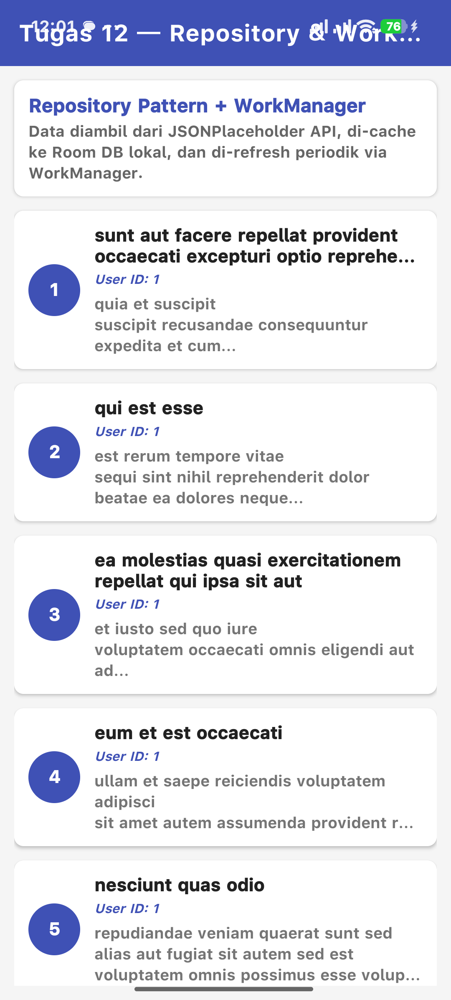

# Tugas 12 Android — Repository Pattern & WorkManager

## Identitas

| | |
|---|---|
| **Nama** | Farrel Ghozy |
| **NIM** | 452024611053 |
| **Mata Kuliah** | Pemrograman Perangkat Bergerak |
| **Topik** | Repository Pattern & WorkManager |

---

## 📱 Tentang Aplikasi

Aplikasi ini adalah implementasi **Repository Pattern** dan **WorkManager** pada platform Android menggunakan **Kotlin**. Aplikasi mengambil data dari API publik [JSONPlaceholder](https://jsonplaceholder.typicode.com/) (endpoint `/posts`), menyimpannya ke database lokal **Room**, dan menampilkannya di **RecyclerView**.

### Fitur Utama

| Fitur | Keterangan |
|:------|:-----------|
| **Repository Pattern** | ViewModel hanya berkomunikasi dengan `PostRepository` — tidak menyentuh DAO atau Retrofit secara langsung |
| **Room Database** | Data dari API di-cache ke database SQLite lokal agar bisa diakses offline |
| **Retrofit + Gson** | HTTP client untuk komunikasi dengan REST API JSONPlaceholder |
| **CoroutineWorker** | Background task menggunakan CoroutineWorker (asinkron, aman untuk suspend functions) |
| **PeriodicWorkRequest** | Refresh data otomatis setiap 15 menit dengan constraints UNMETERED + Charging |
| **SwipeRefreshLayout** | Pull-to-refresh manual untuk trigger sinkronisasi data |
| **Reactive UI** | Data dari Room menggunakan Flow — UI otomatis update saat data berubah |

### Arsitektur

```
┌─────────────────────────────────────────────────────────┐
│                     UI Layer                             │
│  ┌──────────────┐    ┌──────────────────────────────┐   │
│  │ MainActivity │───▶│        MainViewModel         │   │
│  │ (RecyclerView│    │ (AndroidViewModel)           │   │
│  │  + SwipeRef.)│    └──────────┬───────────────────┘   │
│  └──────────────┘               │                        │
├─────────────────────────────────┼────────────────────────┤
│                    Data Layer   │  Repository Pattern    │
│                                 ▼                        │
│  ┌──────────────────────────────────────────────────┐   │
│  │              PostRepository                       │   │
│  │  • getAllPosts()  → Flow<List<PostEntity>>       │   │
│  │  • refreshPosts() → Result<Unit>                 │   │
│  │  • isCacheEmpty() → Boolean                      │   │
│  └──────┬──────────────────────────┬────────────────┘   │
│         │                          │                      │
│         ▼                          ▼                      │
│  ┌──────────────┐          ┌──────────────┐              │
│  │  PostDao     │          │  ApiService  │              │
│  │  (Room)      │          │  (Retrofit)  │              │
│  │  Local DB    │          │  Network     │              │
│  └──────────────┘          └──────────────┘              │
│                                                          │
│  ┌──────────────────────────────────────────────────┐   │
│  │  RefreshDataWorker (CoroutineWorker)              │   │
│  │  dijadwalkan via WorkManager dengan:              │   │
│  │  • PeriodicWorkRequest (15 menit)                 │   │
│  │  • Constraints: UNMETERED + Charging             │   │
│  └──────────────────────────────────────────────────┘   │
└─────────────────────────────────────────────────────────┘
```

---

## 📸 Screenshot Aplikasi

> *Screenshot akan ditambahkan setelah aplikasi dijalankan di perangkat.*

<!-- TODO: Tambahkan screenshot setelah build & install -->
| Tampilan Utama | Data Ter-cache | Pull-to-Refresh |
|:--------------:|:--------------:|:---------------:|
|  |  |  |

---

## 📋 Logcat — Eksekusi Worker

> *Screenshot Logcat akan ditambahkan setelah aplikasi dijalankan.*

```
2026-07-02 12:30:00.123 D/RefreshDataWorker: >>> RefreshDataWorker dimulai...
2026-07-02 12:30:02.456 D/RefreshDataWorker: >>> RefreshDataWorker: SUCCESS — Data berhasil di-refresh dari API ke lokal DB
```

---

## 🧪 Cara Menjalankan

### Prasyarat
- Android Studio Hedgehog (2023.1.1) atau lebih baru
- JDK 17+
- Gradle 8.7
- Perangkat Android fisik (min API 26) atau emulator

### Langkah-langkah

1. **Clone repositori**
   ```bash
   git clone https://github.com/FarrelGhozy/Tugas12_Android_Repository_WorkManager_452024611053.git
   ```

2. **Buka di Android Studio**
   - File → Open → Pilih folder project
   - Tunggu Gradle Sync selesai

3. **Build & Run**
   - Hubungkan perangkat Android via USB (aktifkan USB Debugging)
   - Atau jalankan emulator
   - Klik tombol **Run** (▶) di Android Studio

4. **Verifikasi WorkManager**
   - Buka **App Inspection** → **WorkManager** di Android Studio
   - Pastikan `RefreshDataWorker` muncul dengan status `ENQUEUED` atau `RUNNING`
   - Atau buka Logcat, filter dengan tag `RefreshDataWorker`

---

## 📐 Repository Pattern — Analisis

### Keuntungan Repository Pattern untuk Multi Data Source

Repository Pattern memberikan beberapa keuntungan signifikan ketika aplikasi memiliki lebih dari satu sumber data (dalam kasus ini: **Room Local DB** dan **Retrofit Network API**):

**1. Abstraksi Data Layer**
ViewModel dan UI Layer tidak perlu tahu dari mana data berasal — apakah dari database lokal, jaringan, atau cache. Mereka cukup memanggil method di Repository. Ini mengurangi *coupling* antara komponen dan membuat kode lebih mudah dipelihara.

**2. Strategi Caching yang Konsisten**
Repository menjadi tempat yang tepat untuk menerapkan logika caching. Dalam aplikasi ini, Repository menggunakan strategi *Network-first with local fallback*: data selalu diambil dari API terlebih dahulu, disimpan ke Room, lalu UI membaca dari Room via Flow. Jika jaringan tidak tersedia, data lama di Room tetap bisa ditampilkan. Tanpa Repository, logika ini harus di-duplikasi di setiap ViewModel.

**3. Testing Lebih Mudah**
Dengan Repository, kita bisa menguji ViewModel tanpa perlu database sungguhan atau server API — cukup *mock* Repository-nya. Ini membuat *unit testing* jauh lebih sederhana dibanding jika ViewModel harus menginisialisasi DAO dan Retrofit sendiri.

**4. Perubahan Sumber Data Tidak Mempengaruhi UI**
Jika suatu saat kita ingin mengganti API dari JSONPlaceholder ke API lain, atau mengganti database lokal Room dengan DataStore, cukup ubah implementasi di Repository. Interface yang dilihat ViewModel tetap sama. Ini sejalan dengan prinsip **Dependency Inversion** (SOLID).

**5. Single Source of Truth**
Repository memastikan bahwa ada satu sumber kebenaran untuk data. Tidak ada lagi kebingungan apakah data berasal dari cache lama atau hasil request baru — semuanya terpusat di Repository.

### WorkManager untuk Background Task

WorkManager dipilih karena:
- **Dijamin berjalan** — tetap eksekusi meskipun aplikasi ditutup atau perangkat di-restart
- **Constraint-aware** — bisa dikonfigurasi untuk jalan hanya saat kondisi tertentu (WiFi, charging, idle)
- **Coroutine support** — dengan `CoroutineWorker`, kita bisa pakai suspend functions tanpa blokir thread
- **Battery-friendly** — Android mengoptimalkan eksekusi task dalam batch untuk hemat baterai

---

## 🏗 Struktur Project

```
app/src/main/java/com/tugas12/repository/
├── data/
│   ├── local/
│   │   ├── AppDatabase.kt          # Room Database singleton
│   │   ├── PostDao.kt              # Data Access Object
│   │   └── PostEntity.kt           # Room Entity
│   └── remote/
│       ├── ApiService.kt           # Retrofit service interface
│       ├── PostResponse.kt         # API response model
│       └── RetrofitClient.kt       # Retrofit singleton
├── repository/
│   └── PostRepository.kt           # ★ Repository class (inti tugas)
├── ui/
│   ├── MainViewModel.kt            # ViewModel (hanya lewat Repository)
│   └── PostAdapter.kt              # RecyclerView adapter
├── worker/
│   └── RefreshDataWorker.kt        # ★ CoroutineWorker (inti tugas)
├── MainActivity.kt                 # Entry point
└── MyApp.kt                        # Application class
```

---

## 🔗 Link Repository

[https://github.com/FarrelGhozy/Tugas12_Android_Repository_WorkManager_452024611053](https://github.com/FarrelGhozy/Tugas12_Android_Repository_WorkManager_452024611053)

---

## 📚 Referensi

- [Google Developer Pathway — Lesson 12: Repository & WorkManager](https://developer.android.com/courses/pathways/android-development-with-kotlin-12?hl=id)
- [Android Developers — Guide to App Architecture](https://developer.android.com/topic/architecture)
- [Android Developers — WorkManager Overview](https://developer.android.com/topic/libraries/architecture/workmanager)
- [Room Database Documentation](https://developer.android.com/training/data-storage/room)
- [Retrofit Documentation](https://square.github.io/retrofit/)
- [JSONPlaceholder — Fake API for Testing](https://jsonplaceholder.typicode.com/)
